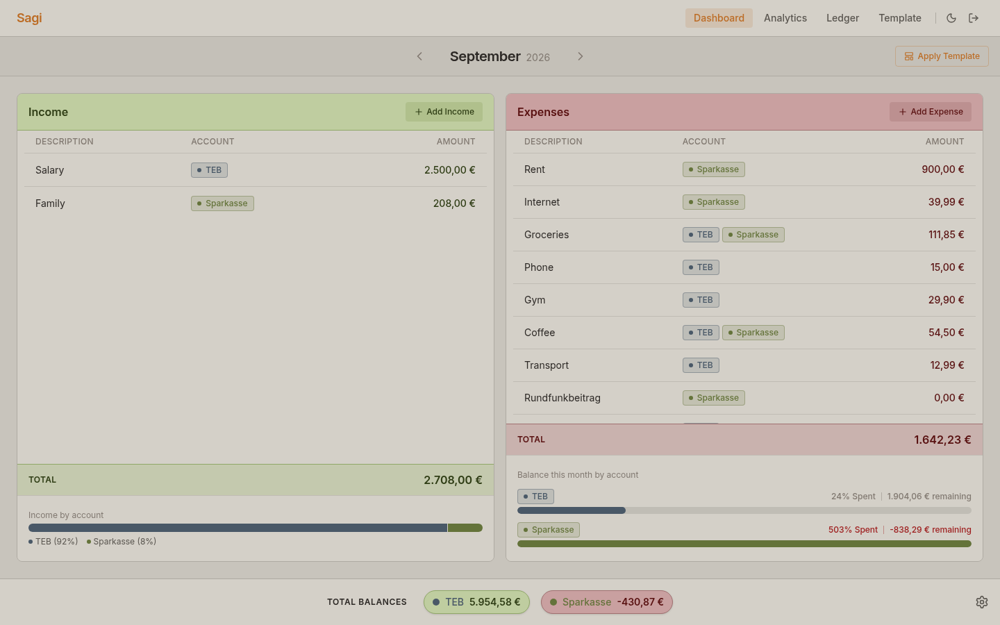
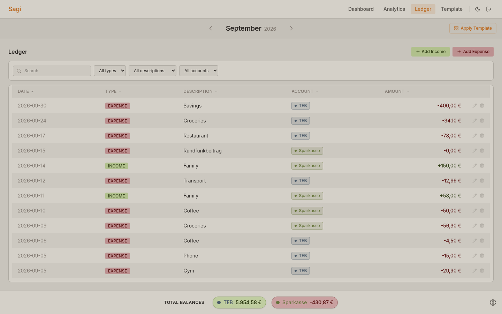
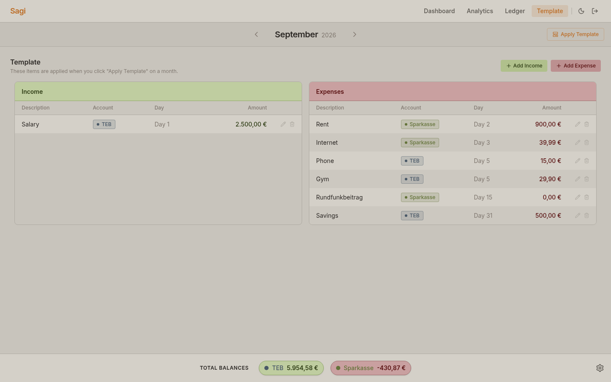
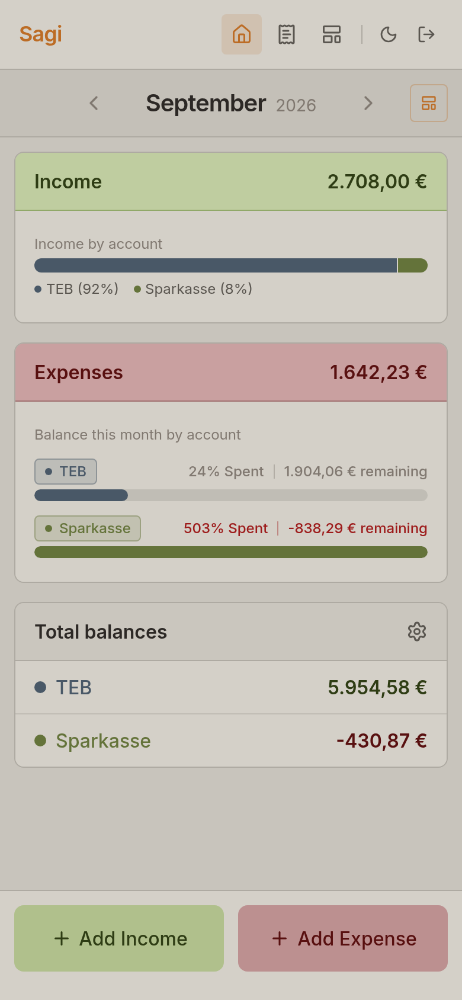
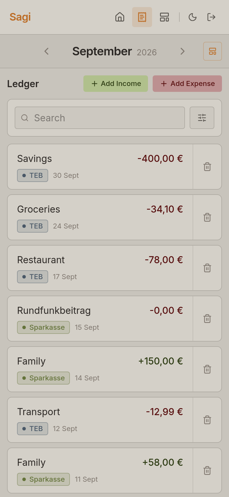
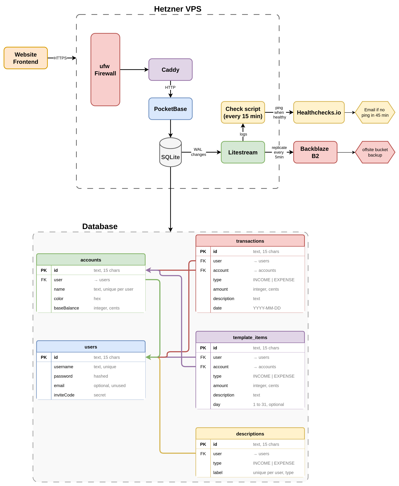

# Sagi

Sagi is a personal finance tracker built around managing income and expenses month by month. Every month is its own page, like a tab in a spreadsheet.

It runs in the browser on desktop and installs as an app on phones. The backend is self hosted PocketBase, a single binary storing data in SQLite, with a React, TypeScript and Tailwind CSS frontend.

Live at [sagiledger.com](https://sagiledger.com).

> I manage this app on my own, so if you want to use it, please ask for an invite code.

## Features

**Dashboard.** The place to see income and expenses at a glance: income on one side, expenses on the other, grouped by label. The bars below each side summarise the month. On the income side they show the total and how it is divided between accounts. On the expense side each account has its own bar showing how much of its income has been spent so far. Future income and expenses can be entered ahead of time, so you can see how much will be left before spending it and manage the monthly budget. This view is for adding only; to edit or delete a transaction, go to the Ledger.

**Ledger.** The log of every transaction in the selected month, with search, filters and sorting. This is also where transactions are edited or deleted. The Ledger is a direct reflection of the data, so the Dashboard is for the daily overview and the Ledger is for the detailed work.

**Template.** A list of recurring income and expenses, such as salary or rent, that can be applied to a month when it starts. This removes the manual work of entering the same items every month. Applying the template overwrites the month's existing transactions, so it is best to apply it before entering anything else.

**Total Balance.** The bar at the bottom of the screen on desktop, and a card on the Dashboard on phones, shows the total amount per account accumulated across all months. The settings icon next to it lets you enter a starting amount, so the balance can match your real bank account without entering every past transaction.

**Desktop and Mobile.** Desktop is built for the full overview on a wide screen. The phone is built for the thumb: totals first, rows as cards, large add buttons at the bottom.

## Screenshots

| Dashboard | Ledger |
|---|---|
|  |  |

| Template | Mobile UI |
|---|---|
|  |   |

## Architecture

| Part | Technology |
|---|---|
| Frontend | React, TypeScript, Vite, Tailwind CSS, Zustand, Recharts, hosted on Vercel |
| Backend | PocketBase (SQLite) on a Hetzner server, Caddy for HTTPS |
| Backups | Litestream streaming to Backblaze B2, healthchecks.io alert if it stops |

More in [docs/architecture.md](docs/architecture.md).

s

## Documentation

- [Architecture](docs/architecture.md)
- [Theming](docs/theming.md)
- [Pages](docs/pages/) and [components](docs/components/)

## License

Released under the MIT License.
